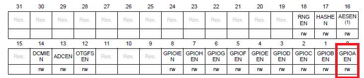
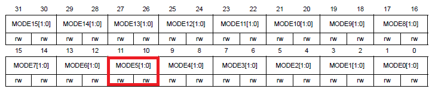
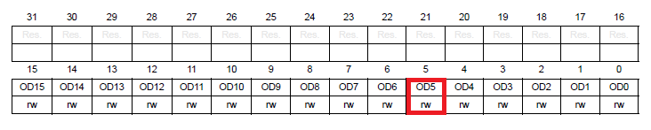
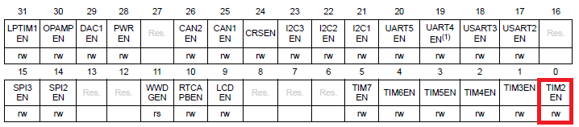

# Diseno_Digital
# Timmers y control de iluminación 
A continuación se muestra un ejercicio ue consiste en la interrupción de un Led mediante un timmer, se prentende mostrar la cofiguración de los timmers como tema cetral, pero tambien se mostrará como es la configuración de otors periféricos.
Se trabajó con la tarjeta SYM32L476RG y como salida se utilizará el led del sistema de desarrollo.

La configuración de los periféricos se hace de la siguiente manera.

## Habilitar AHB2ENR
Se configura la el reloj para el GPIOA así:

## GPIOx_MODER
Ahora se configura que pin se va a escoger del GPIOA en este caso el pin 5

## GPIOx_ODR
Se configura el pin 5 como salida

## Habilitar APB1ENR1
Ahora se procede a configurar el reloj del timmer 2

## Habilitar APB2ENR
Ahora se activa SYSCFG clock para los perifiercos del sistema 

